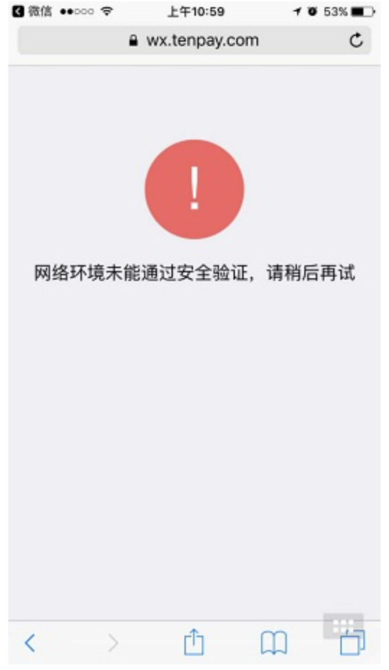

# 微信H5支付常见错误

**解决方法：**  
1. 商户侧统一下单传的终端IP\(spbill\_create\_ip\)与用户实际调起支付时微信侧检测到的终端IP不一致导致的，这个问题一般是商户在统一下单时没有传递正确的终端IP到spbill\_create\_ip导致，详细可参见[客户端ip获取指引](https://pay.weixin.qq.com/wiki/doc/api/H5.php?chapter=15_5)

**对接超级付时，传入正确的客户端IP地址给超级付**

2. 统一下单与调起支付时的网络有变动，如统一下单时是WIFI网络，下单成功后切换成4G网络再调起支付，这样可能会引发我们的正常拦截，请保持网络环境一致的情况下重新发起支付流程

**解决方法：**

1. 当前调起H5支付的referer为空导致，一般是因为直接访问页面调起H5支付，请按正常流程进行页面跳转后发起支付，或自行抓包确认referer值是否为空

2. 如果是APP里调起H5支付，需要在webview中手动设置referer，如\(  
Map extraHeaders = new HashMap\(\);  
extraHeaders.put\("Referer", "商户申请H5时提交的授权域名"\);//例如 http://www.baidu.com \)\)

H5支付不能直接在微信客户端内调起，请在外部浏览器调起

